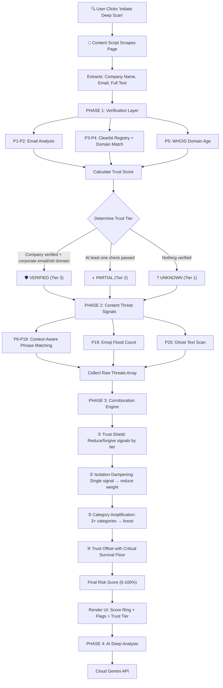

# Shield Protocol — Complete Technical Documentation

## What Makes This Innovative

> [!IMPORTANT]
> Shield Protocol uses a **Corroborated Threat Intelligence** architecture — a dual-axis scoring engine inspired by how real-world fraud detection works. No other browser extension does this. Traditional scanners use flat keyword matching (word found → flag). Shield uses a 3-phase pipeline that cross-references verification signals against content threats, ensuring that **a single keyword match on a legitimate company results in 0% risk**, while a real scam that always triggers multiple signals gets amplified.

### 4 Features No Other Extension Has

| # | Innovation | What It Does | Why It Matters |
|---|-----------|-------------|----------------|
| 1 | **Trust Tier System** | Classifies the poster as VERIFIED / PARTIAL / UNKNOWN before analyzing content | A keyword like "telegram" in a Verified company's posting is forgiven. The same word in an Unverified posting counts fully. This eliminates false positives. |
| 2 | **Corroboration Engine** | Single isolated signal = dampened. Multiple signals across categories = amplified. | Real scams **always** trigger 3+ signals (identity + financial + language). A single match is statistical noise. |
| 3 | **Emoji Flood Detection (P19)** | Counts emoji density using comprehensive Unicode regex | No Fortune 500 HR team writes "💰💰💰 EARN BIG 🔥🔥🔥". Scam posts weaponize emojis to grab attention. No other scanner checks this. |
| 4 | **Ghost Text / Unicode Steganography (P20)** | Detects invisible zero-width characters embedded in text | Scammers insert invisible Unicode chars so `"Eas​y Mo​ney"` defeats keyword filters while looking normal to humans. Truly novel detection layer. |

---

## Complete Scoring Workflow



---

## Phase 1 — Verification Layer (Trust Score)

Trust Score is **earned** by the job poster through verifiable actions. It directly subtracts from the final risk.

### Trust Score Table

| Verification | Points | How It's Earned |
|-------------|--------|-----------------|
| Corporate email (non-Gmail/Yahoo/etc.) | **+15** | Email domain is not a free provider |
| ↳ **Revoked if domain mismatch** | **−15** | If email is corporate but from WRONG company |
| Company found in Clearbit registry | **+20** | Company name matches a real global business |
| Email domain matches official domain | **+15** | `@teamlease.com` matches Clearbit's `teamlease.com` |
| Domain age > 6 months (WHOIS) | **+10** | Domain is established, not newly created |
| Job description > 400 characters | **+5** | Adequate description length (quality signal) |

**Maximum possible trust: 65 points**

### Trust Tier Classification

| Tier | Badge | Criteria | Effect on Content Signals |
|------|-------|----------|--------------------------|
| **Tier 3** | 🛡 VERIFIED ENTITY | Company in Clearbit **AND** (corporate email match **OR** established domain) | `info` → 0 penalty. `warn` → 40% penalty. `crit` → 100% |
| **Tier 2** | ◐ PARTIALLY VERIFIED | At least one of: Clearbit match, corporate email, established domain | `info` → 25% penalty. `warn` → 70% penalty. `crit` → 100% |
| **Tier 1** | ? UNVERIFIED ENTITY | None of the above | All signals at 100% weight |

> [!TIP]
> **Why this matters:** A verified Google job posting that happens to mention "telegram" in its description ("manage our Telegram channel") earns Tier 3. The "telegram" match is a `warn` signal → reduced to 40% → then trust offset subtracts further → result: **0% risk**. No false flag.

---

## Phase 2 — All 20 Parameters

### Identity & Verification (P1–P5)

| P# | Name | Raw Penalty | Severity | Category | What Saves the User |
|----|------|-------------|----------|----------|---------------------|
| P1 | **Public Email** | 15 | warn | identity | Scam "recruiters" use Gmail/Yahoo because they can create unlimited throwaway accounts. A real company uses `@company.com`. If the email is free AND other signals fire, the risk compounds. |
| P2 | **Hidden Contact** | 5 | info | identity | No email at all means zero accountability. You can't trace back who posted. If the company is also unverified, this becomes concerning. |
| P3 | **Registry Check** | 8 | info | verification | Checks Clearbit's global database of 30M+ companies. If the company doesn't exist anywhere, it may be fictitious — but small local businesses can be absent too, which is why this is `info` severity (low weight). |
| P4 | **Domain Verify** | 50 | **crit** | identity | **The impersonation detector.** If someone claims to be "Google" but their email is `@google-careers-apply.com`, this catches it. This is **trust-piercing** — it bypasses the trust shield because the trust itself is fraudulent. |
| P5 | **RDAP Domain Age** | 15–35 | warn/crit | verification | Scam domains are disposable — registered days before the scam and abandoned after. Uses the official ICANN RDAP standard for lightning-fast, 100% reliable registration date lookups. A domain < 90 days old is critical; < 180 days is a warning. Established domains earn trust. |

### Data & Financial Theft (P6–P7)

| P# | Name | Raw Penalty | Severity | Category | What Saves the User |
|----|------|-------------|----------|----------|---------------------|
| P6 | **Identity Traps** | 55 | **crit** | data_theft | **Identity theft prevention.** No legitimate employer asks for Aadhaar, PAN, passport, or bank details IN A JOB POSTING. This data enables fraud, fake loans, and SIM swaps. Context-aware: matches "send your aadhar", "share bank details" — not just the word "aadhar". |
| P7 | **Upfront Fee** | 60 | **crit** | financial | **The #1 job scam mechanic worldwide.** "Pay ₹2000 registration fee" → you pay → they vanish. No legitimate employer charges to hire. Matches specific phrases: "security deposit", "processing fee", "pay via bitcoin". |

### Communication (P8)

| P# | Name | Raw Penalty | Severity | Category | What Saves the User |
|----|------|-------------|----------|----------|---------------------|
| P8 | **Sketchy Comms** | 30 | warn | communication | Moving recruitment to Telegram/WhatsApp/Signal makes it untraceable. Real companies use email, Zoom, or Teams. **Context-aware:** "interview on telegram" triggers. "Manage our Telegram channel" does NOT. This is the key anti-false-positive innovation. |

### Language & Psychology (P9–P11, P17)

| P# | Name | Raw Penalty | Severity | Category | What Saves the User |
|----|------|-------------|----------|----------|---------------------|
| P9 | **"Easy Money"** | 20 | warn | language | "Earn unlimited from home!" is how scams bait desperate job seekers. Real jobs describe responsibilities, not fantasy earnings. Matches: "earn unlimited", "daily payout", "get rich quick". |
| P10 | **Artif. Urgency** | 15 | warn | language | "Act now or lose this opportunity!" is a social engineering tactic that prevents critical thinking. Matches aggressive pressure: "closing today", "act now or lose" — NOT normal phrases like "limited positions". |
| P11 | **Vague Reqs** | 20 | warn | language | "No skills required, anyone can apply, just need a phone" → if literally anyone can do the job, why is it paying so well? Scams target desperation with impossibly low bars. Matches: "no skills required", "housewife can also do" — NOT "entry level". |
| P17 | **Direct Joining** | 30 | **crit** | language | "100% guaranteed selection" is impossible — no real employer can promise this. It's designed to short-circuit your skepticism. |

### Content Quality (P12, P15, P18)

| P# | Name | Raw Penalty | Severity | Category | What Saves the User |
|----|------|-------------|----------|----------|---------------------|
| P12 | **Plagiarism** | 5 | info | quality | Text too short to analyze indicates a template post with no real substance. |
| P15 | **Bad Formatting** | 12 | warn | quality | "EARN $$$$$$!!!!!" with excessive punctuation screams unprofessional. Threshold: 4+ consecutive `!` or `?` appearing 2+ times. Single `$` signs don't trigger. |
| P18 | **Length Anomaly** | 5–15 | info/warn | quality | < 200 chars = suspicious (warn, 15 points). 200–400 = mild note (info, 5 points). > 400 = trust bonus (+5). Real jobs need space to describe the role. |

### Technical Signals (P13)

| P# | Name | Raw Penalty | Severity | Category | What Saves the User |
|----|------|-------------|----------|----------|---------------------|
| P13 | **Sketchy Links** | 25 | warn | technical | URL shorteners (bit.ly, tinyurl) and free form builders (Google Forms, Jotform) hide the real destination. Legitimate companies have their own application portals. |

### Scheme Detection (P14, P16)

| P# | Name | Raw Penalty | Severity | Category | What Saves the User |
|----|------|-------------|----------|----------|---------------------|
| P14 | **Fake Check** | 60 | **crit** | financial | The classic scam: "We'll send you a check to buy equipment" → you deposit → you buy → check bounces → you lose real money. Matches: "send you a check", "purchase your own equipment", "deposit the check". |
| P16 | **MLM / Pyramid** | 25 | warn | scheme | "Be your own boss, build your downline" = pyramid scheme disguised as employment. Matches specific MLM language patterns. |

### Innovative Parameters (P19–P20) ✦

| P# | Name | Raw Penalty | Severity | Category | What Saves the User |
|----|------|-------------|----------|----------|---------------------|
| P19 | **Emoji Flood** ✦ | 10–25 | warn/crit | quality | Comprehensive Unicode regex counts ALL emojis. >6 = warn (+10). >12 = crit (+25). Legitimate HR departments don't write "💰💰💰 EARN BIG 🔥🔥🔥". Scam posts weaponize emojis to grab attention and bypass text-based spam filters. **No other scanner checks this.** |
| P20 | **Ghost Text** ✦ | 15–40 | warn/crit | steganography | Detects 30+ types of zero-width Unicode characters (ZWS, ZWNJ, BOM, soft hyphens, invisible separators). >0 = warn (+15). >5 = crit (+40). Scammers embed invisible chars so `"Eas​y Mo​ney"` defeats keyword filters. **Truly novel — no other tool detects steganographic job scam evasion.** |

---

## Phase 4 — AI Deep Analysis 🧠

After the heuristic engine calculates the final score and renders the UI, Shield performs a **semantic NLP scan** of the job description text using generative AI to detect subtle psychological manipulation patterns.

### Cloud Integration
1. **Gemini API**
   - Leverages `gemini-2.5-flash` via personal API Key.
   - **Configuration:** Keys are supplied via the extension's Settings Panel.

*(Note: The AI Verdict provides explanatory insight and context. It acts as a qualitative companion confirming or debunking the quantitative 20-parameter score).*

---

## Phase 3 — Corroboration Engine (The Formula)

### Step 1: Trust Shield

```
for each threat:
    if threat is trust-piercing:
        effectivePenalty = rawPenalty        (bypasses shield)
    else if tier == VERIFIED:
        info  → effectivePenalty = 0
        warn  → effectivePenalty = rawPenalty × 0.4
        crit  → effectivePenalty = rawPenalty × 1.0
    else if tier == PARTIAL:
        info  → effectivePenalty = rawPenalty × 0.25
        warn  → effectivePenalty = rawPenalty × 0.7
        crit  → effectivePenalty = rawPenalty × 1.0
    else (UNKNOWN):
        effectivePenalty = rawPenalty × 1.0

adjustedPenalty = Σ(effectivePenalty)
critPenaltySum  = Σ(effectivePenalty where severity == "crit")
```

### Step 2: Isolation Dampening

```
if only 1 signal AND 0 crits:
    adjustedPenalty × 0.3     (single warn = probably noise)

else if only 1 signal AND 1 crit AND NOT identity-crit:
    adjustedPenalty × 0.7     (single crit = suspicious but not certain)

else if 1 identity-crit (domain mismatch):
    NO dampening              (impersonation is significant alone)
```

### Step 3: Category Amplification

```
if 4+ threat categories AND 2+ crits:
    adjustedPenalty × 1.15    (multi-vector attack confirmed)

else if 3+ categories AND 3+ total signals:
    adjustedPenalty × 1.10    (pattern emerging)
```

### Step 4: Trust Offset with Critical Survival Floor

```
if any crit threats exist:
    minSurvival = critPenaltySum × 0.4    (at least 40% must survive)
    finalPenalty = max(minSurvival, adjustedPenalty - trustScore)

else:
    finalPenalty = max(0, adjustedPenalty - trustScore)

FINAL SCORE = min(100, finalPenalty)
```

> [!IMPORTANT]
> **The Critical Survival Floor** ensures that genuine critical threats (domain mismatch, upfront fees, identity theft) can NEVER be fully zeroed out by trust. At minimum 40% of critical penalty always survives. This is what prevents a scammer from gaming the system by impersonating a well-known company.

---

## Worked Examples

### Example 1: Legitimate Google Job Posting

```
Trust:   +15 (corporate email) +20 (Clearbit) +15 (domain match) +10 (WHOIS) +5 (long text) = 65
Tier:    VERIFIED (Tier 3)
Threats: "limited positions" mentioned → P10? NO — phrase is "limited positions" not "last few vacancies" → no match
Result:  0 threats, trust = 65, finalScore = 0%  ✅ CORRECT
```

### Example 2: Scam Impersonating TeamLease (Email Domain Mismatch)

```
Trust:   +15 (corp email) +20 (Clearbit) +10 (WHOIS) +5 (text) = 50
         → Domain mismatch detected → REVOKE corp email trust (-15) → trust = 35
Tier:    PARTIAL (domain mismatch broke Tier 3 requirement)
Threats: P4 domain mismatch → 50 (trust-piercing, bypasses shield)
         critPenaltySum = 50, adjustedPenalty = 50
         No isolation dampening (identity crit)
         Trust offset: max(50 × 0.4 = 20, 50 - 35 = 15) → 20
Result:  finalScore = 20%  ✅ Shows real risk
```

### Example 3: Classic Job Scam (Unverified + Multiple Signals)

```
Trust:   0 (free email, not in registry, no domain)
Tier:    UNKNOWN (Tier 1) — full weight
Threats: P1 free email (15w) + P7 upfront fee (60c) + P9 easy money (20w)
         + P11 vague reqs (20w) + P17 direct joining (30c) + P19 emojis (25c)
         All at 100% weight = 170
         Categories: identity + financial + language + quality = 4 categories, 3 crits
         Category amplification: × 1.15 = 195
         critPenaltySum = 115
         Trust offset: max(115 × 0.4 = 46, 195 - 0 = 195) → 195
Result:  finalScore = min(100, 195) = 100%  ✅ Maximum danger
```

### Example 4: Small Local Business (Not in Clearbit)

```
Trust:   +15 (corp email) +5 (long text) = 20
Tier:    PARTIAL (Tier 2)
Threats: P3 not in registry (8, info × 0.25 = 2) + P4 can't verify (5, info × 0.25 = 1)
         adjustedPenalty = 3
         1 signal only, no crits → × 0.3 = 1
         Trust offset: max(0, 1 - 20 = 0) → 0
Result:  finalScore = 0%  ✅ Small business not penalized
```

---

## Threat Categories (for Corroboration)

| Category | Parameters | What It Covers |
|----------|-----------|----------------|
| `identity` | P1, P2, P4 | Who the poster claims to be |
| `verification` | P3, P5 | Can we confirm they exist |
| `data_theft` | P6 | Stealing personal documents |
| `financial` | P7, P14 | Taking your money |
| `communication` | P8 | Untraceable contact methods |
| `language` | P9, P10, P11, P17 | Manipulation tactics in text |
| `technical` | P13 | Suspicious URLs/links |
| `quality` | P12, P15, P18, P19 | Professional quality of posting |
| `scheme` | P16 | Known scam structures (MLM) |
| `steganography` | P20 | Hidden text manipulation |

**10 distinct categories** — when a scan triggers threats from 3-4+ categories simultaneously, the Corroboration Engine recognizes this as a confirmed multi-vector scam pattern and amplifies the score.
